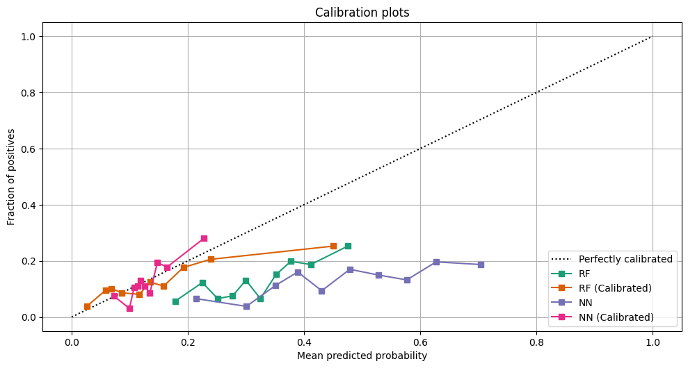
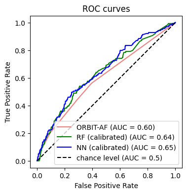
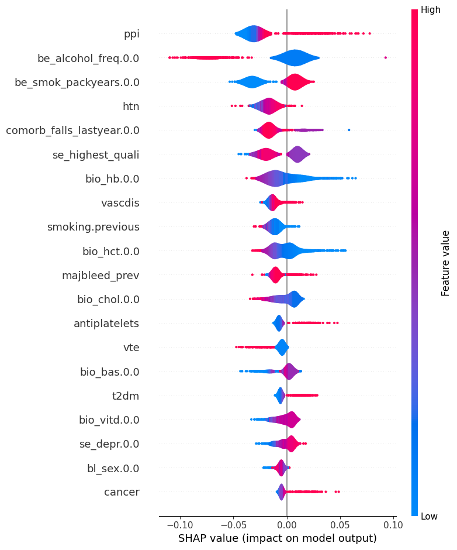

# Major Bleeding Risk Prediction Tool

## Introduction

### Background:
- **Definition:** Major bleeding refers to bleeding into critical areas or organs like the stomach, brain, or joints.
- **Case-fatality:** 13.4%
- Anticoagulants, commonly known as "blood thinners", significantly increase the risk of major bleeding.
- Validated Clinical Scoring Systems: Tools for determining the risk of major bleeding when on anticoagulants.
  - HAS-BLED
  - VTE-BLEED
  - ORBIT-AF: Current recommendation in the UK and other regions to guide AF anticoagulation.
    - Parameters: Sex, age, major bleeding history, kidney function, antiplatelet treatment

### Aim:
Develop a risk prediction tool with superior predictive performance compared to ORBIT-AF. The tool should utilize predictors that can be easily accessed in a standard clinical setting.

### Outcome Definition:
- **Major Bleeding Event:** The primary outcome we aim to predict is the occurrence of a major bleeding event within a 5-year span following data collection.

### Study Population:
- **Source:** UK Biobank
- **About:** An extensive, ongoing prospective cohort study encompassing demographic, lifestyle, medical, and genetic information.
- **Participants:** From the initial cohort of around 500,000 participants between the ages of 40 and 69, our study focused on Warfarin users, which narrowed down the sample to 5,328 participants.
  - **Major Bleed Occurrence:** Out of the 5,328 Warfarin users:
    - 4,634 participants did not experience a major bleeding event within 5 years.
    - 694 participants had a major bleeding event within the same timeframe.
- **Publications:** Over 6,000 research papers have been based on the UK Biobank data.

## Methods

### Predictors:
- **Selection Criteria:** Based on domain knowledge and literature review.
- **Categories:**
  - Demographic: Age, sex, ethnicity
  - Socio-economic: Highest qualifications, Deprivation index
  - Behavioural: Smoking, alcohol consumption
  - Biological: Blood pressure, Haematology, Liver and Kidney markers, Nutritional indicators (like albumin, lipids, glucose)
  - Medical History: HTN, T2DM, CHF, liver disease, anaemia, cancer, VTE, vascular disease, COPD, previous major bleed
  - Medications: Benzodiazepines, NSAIDs, OCS, PPI, SSRI, St John’s Wart
  - Others: Frequency of falls

### Unsupervised Methods:
- **Clustering:** K-prototypes due to mixed data types.
- **Distance Metrics:** Euclidian distance for numeric data and simple matching coefficient for categorical data.
- **Optimal Cluster Count:** Determined using the Silhouette score and WCSS.
- **Repetitions:** Clustering was done 100 times to optimize cluster compactness.
- **Results Interpretation:** 
  - Cluster prototypes
  - Univariate analysis
  - Chi-squared test with outcome

### Model Training and Hyperparameter Tuning:
- **Preprocessing:** 80/20 train-test split (stratified by outcome) and data scaling.
- **Balancing:** SMOTE (up to 50%) and Undersampling (up to 100%), performed within each cross-validation training iteration.
- **Random Forest:** GridSearchCV with repeated stratified 5-fold cross-validation (20 repeats) was used.
  - Parameters tuned: Tree depth, min. samples for leaf and split, split criterion, max. features per split
  - 2000 estimators were used during training
- **Neural Network (Multilayer Perceptron with 2 hidden layers):** 
  - GridSearchCV + Skorch with repeated stratified 5-fold cross-validation (100 repeats).
  - Parameters tuned: Optimizer, learning rate, neuron count per layer, dropout.
  - Early stopping was determined using a nested validation set (patience = 5).
- **Calibration:** Trained models were calibrated.
- **Evaluation:** AUC evaluated on the test set, and feature importance plots were showcased.
- **Random Seed:** Set to 42 for all randomness-involved methods.
 
## Results

### Clustering:

- Two distinct clusters were identified based on the Silhouette score.
- The association between cluster membership and major bleeding risk was found to be highly significant (Chi-squared test p-value = 3.18 * 10^-12).
- Based on the cluster prototypes:
  - **Cluster 1:** 
    - Age: ~62
    - Less deprived
    - Smoking: 11.6 pack-years, with never smokers being the most common
    - Alcohol consumption: 2.3 days/week
    - BMI: 27.7
    - Overall, this cluster represents a healthier subset of the population.
  - **Cluster 2:** 
    - Age: ~62
    - More deprived
    - Smoking: 22.5 pack-years, with a mode of previous smokers
    - Alcohol consumption: 2.6 days/week
    - BMI: 31.75
    - This cluster indicates a population with more health challenges.

### Predictive Modeling:

- **Random Forest:** 
  - **Validation:** K-fold cross-validation (5-fold)
  - **Optimal hyper-parameters:** Min. samples/leaf: 1 | Min. samples/split: 14 | Max. depth: 20 | Max. features: Sqrt | Criterion: Gini
  - **Performance:** 
    - Uncalibrated AUC: 0.6369
    - Calibrated AUC: 0.6352
- **Neural Network:** 
  - **Validation:** K-fold cross-validation (5-fold)
  - **Optimal hyper-parameters:** Optimizer: NAdam | LR: 0.00005 | Neurons in layer 1: 16 | Neurons in layer 2: 16 | Dropout: 0.2
  - **Performance:** 
    - Uncalibrated AUC: 0.6080
    - Calibrated AUC: 0.6453
- **ORBIT-AF (for reference):** AUC: 0.5987

    

        
        
    

### Feature Importance:

Using Shapley values, we examined the features driving model decisions. While some overlapped with ORBIT-AF, we observed new and significant findings:

- **GI Bleed-related predictors:**
  - Proton-pump inhibitors
  - Alcohol use (also found in HAS-BLED)
  
- **Intracerebral Bleed-related predictors:**
  - Hypertension
  - Falls
  - Alcohol use
  
- **Vascular conditions predictors:**
  - T2DM
  - Atherosclerotic diseases
  - Smoking
  
- **Unexpected findings:**
  - The model tends to classify frequent drinkers and those with frequent falls as non-bleeders.
  - Factors like Basophils count and Vitamin D levels influenced model predictions.
 

## Discussion

### Conclusions:

- **Clusters:** Our unsupervised clustering approach effectively distinguished two groups characterized by distinct health profiles.
  
- **Predictive Capability**: Both machine learning models demonstrated superior predictive performance over the ORBIT-AF scoring system. Notably, the Neural Network model showcased the highest AUC among the supervised algorithms. Fine-tuning the decision threshold could enhance the discriminatory ability of our model.
  
- **Model Features:** Features like Proton-pump inhibitors, falls risk, and alcohol consumption, not conventionally used, showed promising potential and may warrant further investigation.

### Limitations:

- **Population Representation:** The UK Biobank data might not be fully representative, especially in terms of elderly and non-Caucasian populations.
  
- **Drug Limitation:** At the time of UK Biobank recruitment, Direct Oral Anticoagulants (DOACs) were not yet introduced.
  
- **Data Comparison:** While our dataset is comprehensive, it remains relatively smaller in scale compared to the ORBIT-AF Registry. An external validation process would enhance the reliability of our findings.
  
- **Model Tuning:** While our models performed commendably, there's scope for improvement. The hyperparameters tuning process wasn't exhaustive, leaving out potential optimizations such as weight decay, momentum, or inclusion of additional layers. Future models might also benefit from exploring boosted tree approaches like gradient boosting.

